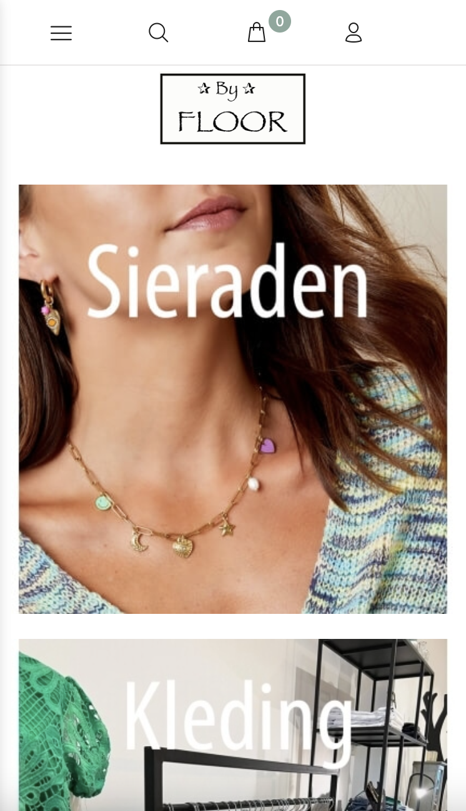
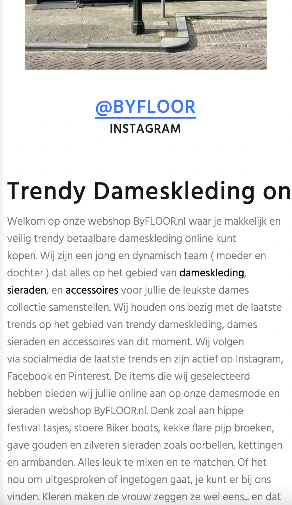
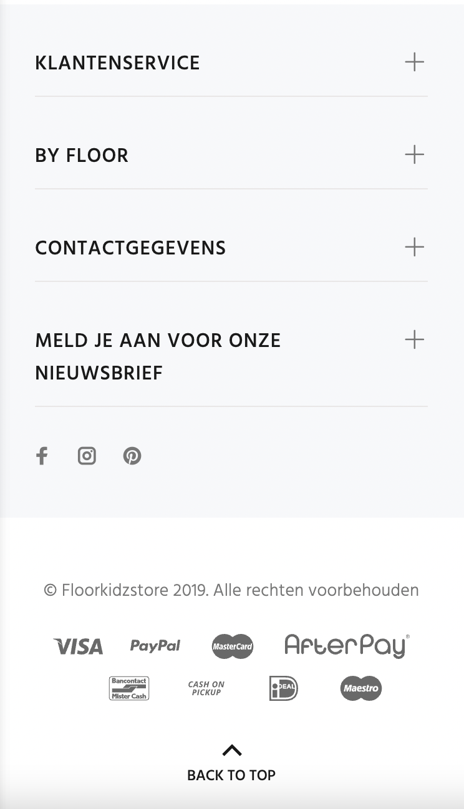
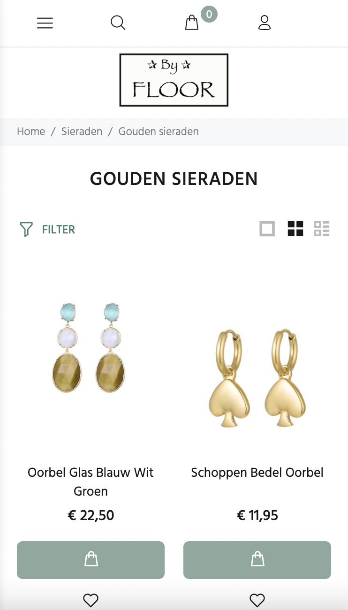
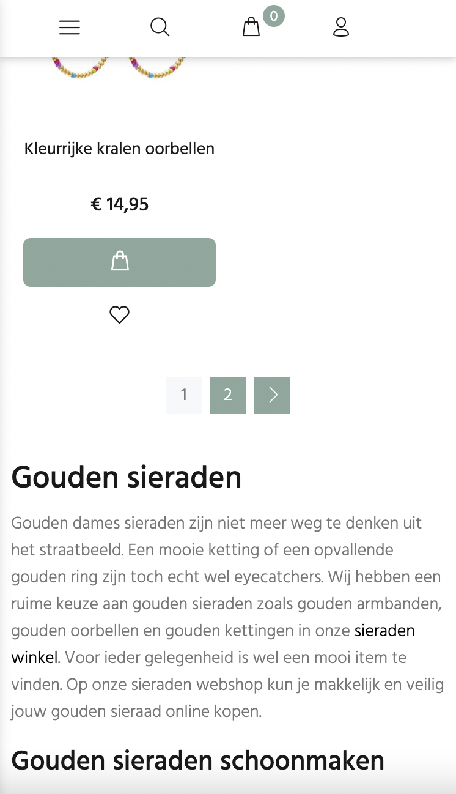
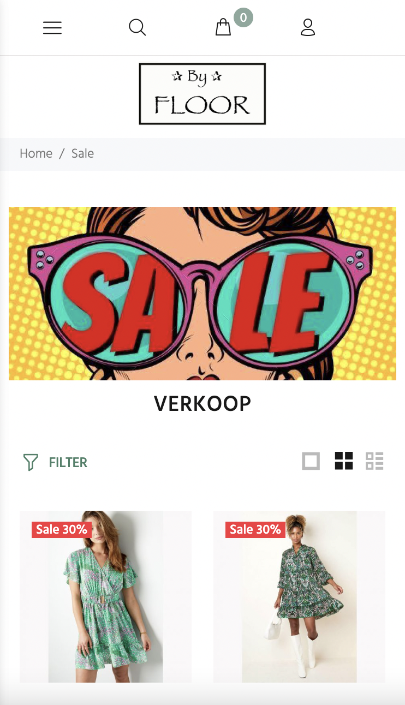
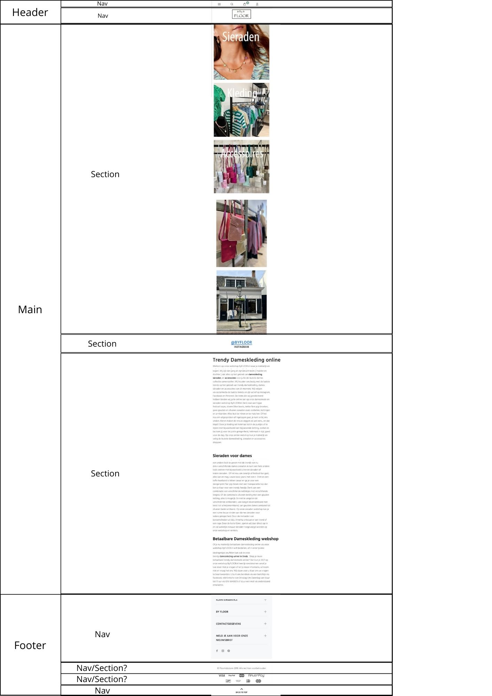
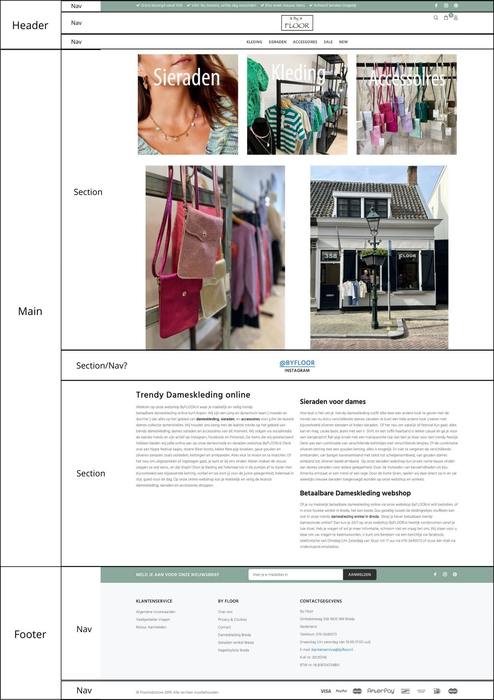
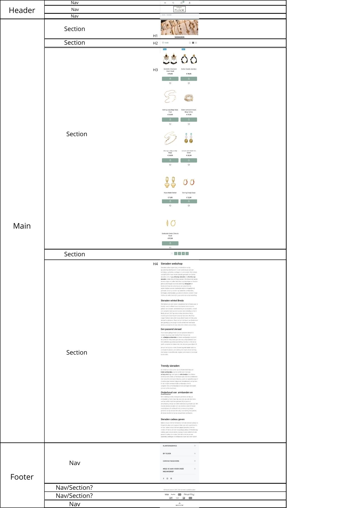
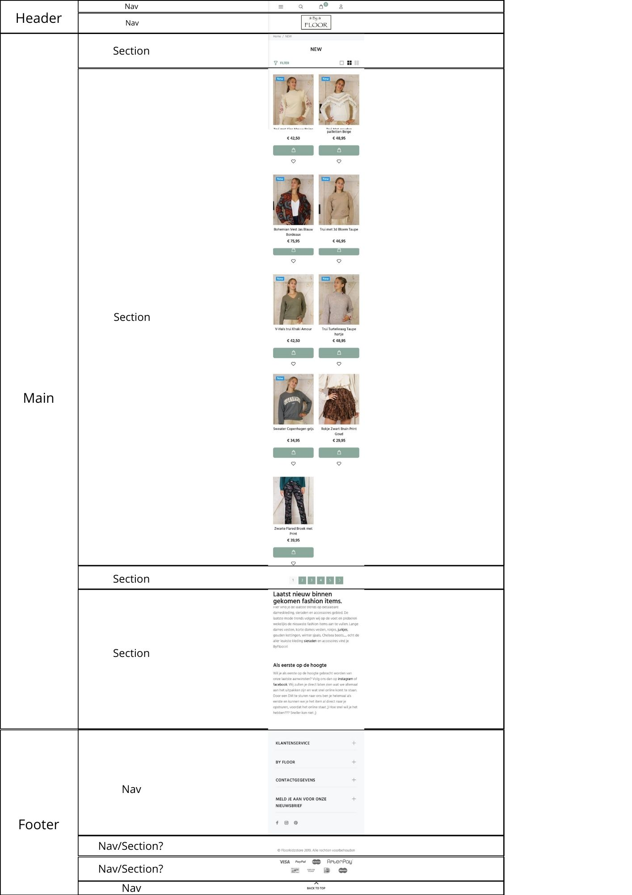

# Procesverslag
Markdown is een simpele manier om HTML te schrijven.  
Markdown cheat cheet: [Hulp bij het schrijven van Markdown](https://github.com/adam-p/markdown-here/wiki/Markdown-Cheatsheet).

Nb. De standaardstructuur en de spartaanse opmaak van de README.md zijn helemaal prima. Het gaat om de inhoud van je procesverslag. Besteedt de tijd voor pracht en praal aan je website.

Nb. Door *open* toe te voegen aan een *details* element kun je deze standaard open zetten. Fijn om dat steeds voor de relevante stuk(ken) te doen.

## Jij

  
uitwerken voor kick-off werkgroep

  ### Auteur:
  Sarah Ahmadi

  #### Je startniveau:
  Blauw

  #### Je focus:
  Surface plane
 

## Je website

  
uitwerken voor kick-off werkgroep

  ### Je opdracht:
  https://www.byfloor.nl

  #### Screenshot(s) van de eerste pagina (small screen): 
  Homepage van ByFloor
  
  
  

  #### Screenshot(s) van de tweede pagina (small screen):
  Pagina van de sieraden en pagina van de sale
  
  
  

## Toegankelijkheidstest 1/2 (week 1)

  
uitwerken na test in 2e werkgroep

  ### Bevindingen
  Lijst met je bevindingen die in de test naar voren kwamen:
  -Als eerste viel me op dat de voiceover echt direct begon met praten. Hij was geen moment stil en ik kreeg het geluid niet direct zachter, dus moest ik hem eerst uitzetten en toen pas kon ik het geluid zachter doen.
  -De voiceover begint vanzelf voor te lezen wat er op de website te zien is.
  Hij begon linksboven met de banner 'Gratis bezorgd vanaf 50 euro, voor 16u besteld zelfde dag verzonden, elke week nieuwe items, etc. Dit lijkt mij erg fijn om te weten, want het is toch wel belangrijke informatie die zou kunnen helpen om een beslissing te maken of je op deze site iets zou willen bestellen. Het enige vervelende hieraan is, dat als je op een nieuw kopje klikt, bijvoorbeeld als je van de 'kleding' naar de 'sieraden' pagina gaat, hij al die informatie opnieuw gaat voorlezen, terwijl je dit dus al weet.
  -Ik klikte op de sieraden pagina en wou kijken wat er gebeurde als ik zou spelen met de filters. Ik klikte op de 20% korting filter en er was nog maar 1 item in beeld. De voiceover gaf dit niet duidelijk aan.

## Breakdownschets (week 1)

  
uitwerken na afloop 3e werkgroep

  ### de hele pagina: 
  
  

  ### dynamisch deel (bijv menu): 
  
  

  ### wellicht nog een dynamisch deel (bijv filter): 
  

## Voortgang 1 (week 2)

  
uitwerken voor 1e voortgang

  ### Stand van zaken
  Alle html van de 1e pagina heb ik erin staan. Ik weet nog van vorig jaar hoe ik in de footer bijvoorbeeld een uitklapbaar menu maak, dus dit heb ik makkelijk kunnen maken. Het ziet er nu erg chaotisch uit, maar alles staat er in ieder geval wel in. Na dit voorgangsgesprek weet ik of alles netjes in de juiste sections staat, en kan ik gaan beginnen met css. Daar heb ik wel zin in, want het stijlen vind ik het leukst, maar ook lastig.

  ### Agenda voor meeting
  samen met je groepje opstellen

Sarah: Icoontjes maken, wat moet klikbaar zijn, wat is samen een section, is onderin ook een nav
Jornt: Hoe fonts vinden van je site
Magdalena: Grid indeling plaatjes

  ### Verslag van meeting
  hier na afloop snel de uitkomsten van de meeting vastleggen

- Punt 1: Sections goed indelen
- Punt 2: Icoontjes apart van elkaar downloaden via zo'n site
- Punt 3: Onderin geen nav gebruiken

## Voortgang 2 (week 3)

  
uitwerken voor 2e voortgang

  ### Stand van zaken
  Begonnen aan m'n css en dit ging eigenlijk beter dan ik had verwacht.
  Veel herkende ik nog van vorig jaar of kon ik terug vinden in opdrachten
  van vorig jaar, dus dan herinnerde ik me weer hoe bepaalde dingen werken.
  Ik merk dat ik het lastig vind om erin te komen, maar als ik er eenmaal in zit
  dan gaat het best goed.

  ### Agenda voor meeting
  samen met je groepje opstellen

 Esra:
 -Ik struggle op dit moment met mijn iconen rechts krijgen in het menu.
 Ik wil dat het logo rechts blijft, en mijn logo links.
 -Mijn afbeelding in de eerste section is heel condensed terwijl ik wel de juiste afmetingen en afbeelding heb gebruikt.
 Karenza:
 -@fontface snap ik even niet, verschil tussen flex en grid (wanneer is wat beter)
 Jornt:
 -Ik wil graag weten hoezo mijn 2e section niet het scherm volledig vult.
 -Waarom kan ik de 'font-weight' van m'n nav niet aanpassen?
 -Bepaalde afbeelding laadt niet bij testen telefoon, hoe komt dat?
 Liam:
 Ik:
 -Header images overhoop gehaald hoe fix ik het weer
 -Hoe maak ik een button van een img en een woord samen
 -Hoe spreek ik alleen het logo aan, laatste img van de header in de 2e nav

  ### Verslag van meeting
  - Punt 1: @Font face gebruiken. Dit kende ik hiervoor nog helemaal niet...
  - Punt 2: Een root aanmaken, zodat ik var() kan gebruiken als ik kleuren wil gebruiken. Dit kende ik ook nog helemaal niet.
  - Punt 3: Niet schreeuwen in html. In css kan je aangeven dat het in uppercase moet zijn.

## Toegankelijkheidstest 2/2 (week 4)

  
uitwerken na test in 9e werkgroep

  ### Bevindingen
  Lijst met je bevindingen die in de test naar voren kwamen (geef ook aan wat er verbeterd is):

## Voortgang 3 (week 4)

  
uitwerken voor 3e voortgang

  ### Stand van zaken
  Ik ben begonnen aan de 2e html pagina. Ik heb nu ook 3 CSS bestanden. Alles wat op beide pagina's voorkomt, heb ik gekopieerd vanuit het 1e CSS bestand, en in het gezamelijke CSS bestand geplakt, zoals de header, nav en footer.
  Ik gebruik steeds vaker dat groene tekstje in css om erbij te zetten wat de code inhoud. Dit vind ik voor mijzelf ook handig, want als ik er weer mee bezig ga weet ik welke code waarvoor is. Vorig jaar deed ik dit niet en ik merk hoe handig het is, anders word ik zo duizelig van de chaos.
  Ik ben ook aan het nadenken wat ik wil doen voor de surface plane. Ik denk aan videos/geluid, formulieren, een thema en light/dark mode. Voor de laatste 2 heb ik wel hulp nodig, dus ik ga een student assistent vragen om hulp.

  ### Agenda voor meeting
  samen met je groepje opstellen

Jornt:
-Waarom blijft niet mijn gehele NAV bar plakken?
-Hoe krijg ik m’n tekst in dit sectie 4 responsive?
-Er zijn maar 3 fonts beschikbaar om te downloaden, lukt niet om font-weight mee te geven.
Karenza:
-Ik heb ook vraag over responsive text / footer
-En een vraag over “overlappen” van fotos/backgrounds
-Vraag over alt attributen en hoe specifiek de uitleg van de foto moet zijn.
-En eigenlijk gwn meer uitleg over responsiveness
Esra:
Liam:
-Hoe krijg ik 3 verschillende menu opties
-Hoe maak ik slideshow met animaties
-Hoe zorg ik ervoor dat ik verschillende menus kan sluiten met 1 knop
Ik:
-Ik kan de fonts niet vinden omdat ze geen duidelijke namen hebben
-Hoe maak ik een rondje boven het winkelmandje
-Hoe krijg ik een link en een p die onder elkaar staan, dichter op elkaar

  ### Verslag van meeting
  hier na afloop snel de uitkomsten van de meeting vastleggen

  - Punt 1: De fonts moet ik in een mapje plaatsen, anders herkent hij ze niet
  - Punt 2: De font weights kan ik ook in de font face zetten, zodat hij deze automatisch pakt, dit wist ik nog niet.
  - Punt 3: Als ik elementen dichter op elkaar wil krijgen, kan ik margin: 0em; gebruiken. Dit komt bijvoorbeeld voor bij de instagram link met daaronder het woord 'instagram'.

## Eindgesprek (week 5)

  
uitwerken voor eindgesprek

  ### Je uitkomst - karakteristiek screenshots:
  

  ### Dit ging goed/Heb ik geleerd: 
  Ik heb natuurlijk niet de moeilijkste website gekozen, maar dit was al echt een uitdaging voor mij. Ik ben ten eerste echt blij met hoeveel js kennis ik heb opgedaan, ik heb nog nooit zoveel js gebruikt. Ik heb geleerd om met :root te werken (hier snapte ik vorig jaar niks van), ik heb geleerd om met @fontface te werken, dit heb ik vorig jaar niet eens geleerd. Ook ben ik heel blij met dat de dark mode werkt en ik zelf een aanmeld formulier heb gemaakt in de footer bij 'meld je aan voor onze nieuwsbrief'. Ik merkte dat ik sowieso meer vragen stelde aan de student assistent, vorig jaar deed ik dit amper omdat ik me dan dom voelde. Maar Donna reageerde echt direct. Ze gaf niet gelijk het antwoord weg, maar gaf steeds een hint waardoor ik zelf ook kon nadenken, dit vond ik wel erg fijn, want zo ging ik het ook begrijpen ipv. dat ze het antwoord maar gaf. Op de laatste dag voor het inleveren, stuurde ik mijn site naar Donna en vroeg of zij nog laatste tips had om de puntjes op de i te zetten. Ik kreeg de volgende tips: filter:invert(1); voor dark-mode. Dat heeft me echt heel erg geholpen met witte achtergronden bij img, die er lelijk uitzagen als dark-mode aanstond en daardoor heb ik ook veel extra code kunnen weg halen. Kijken naar kleurgebruik voor inclusiviteit bij custom thema. Geen px gebruiken bij font-size (ik wist niet dat dat niet mocht, dus snel alles veranderd naar em). Dit waren kleine veranderingen, maar uiteindelijk maakte het een groot verschil.

  
  
  
  
  
  
  
  
  

  ### Dit was lastig/Is niet gelukt:
  Update last minute: wel gelukt!! Mijn broertje heeft me geholpen last minute en door middel van een class is het dus wel gelukt! Ik snap nu ook hoe het moet en daar ben ik echt blij mee. Ook weet ik nu hoe ik de tekst van de sale op de afbeelding kan krijgen. Ik heb 2 extra articles toegevoegd om dit te laten zien. Ik heb nu alleen niet genoeg tijd om alles te veranderen, maar ik snap het tenminste :)

  Mijn tekst voordat het lukte:
  Het is mij niet gelukt om de oude prijs naast de nieuwe prijs te krijgen.
  Het kwam doordat dit eerst nog niet zo op de site stond, maar later was er ineens een korting. Ik dacht dit is een uitdaging dus ik wil het proberen, maar het is mij niet gelukt. Ik denk dat ik het anders had moeten aanpakken in de html, maar ik was al zo ver dat als ik iets veranderde, ik alles overhoop haalde en dan kreeg ik paniek. Wel is het gelukt om de oude prijs door te strepen en de nieuwe rood te maken. Om dit voor mensen met een screenreader op te lossen, heb ik de sale bij de alt tekst geplaatst. Zo weten zij ook welke items in de sale zijn.

  
  
  
  
  
  
  
  

## Bronnenlijst

  
continu bijhouden terwijl je werkt

  1.  bron hr: https://www.w3schools.com/howto/howto_css_style_hr.asp
  Deze bron heb ik gebruikt om in de header een dun lijntje te krijgen, tussen de nav en het logo van de site. Het is maar een klein iets, maar dit was wel iets wat ik moest opzoeken.
  2. bron: https://www.w3schools.com/howto/tryit.asp?filename=tryhow_js_toggle_dark_mode
  Deze bron heb ik gebruikt om een dark mode button te creeeren op de site. Dit was makkelijker dan ik dacht, toen ik het zag dacht ik ook van 'dit had ik zelf eigenlijk ook kunnen bedenken', maar toch moest ik het opzoeken.
  3. bron: https://www.youtube.com/watch?v=tkLi7fkPdAc, https://www.youtube.com/watch?v=pzCI7DXL0Qc, 
  Als een van de surface plane onderdelen, heb ik video's toegevoegd aan m'n site. Ik wist hoe dit moest van voorgaande jaren, dus ik had geen bron nodig om te weten hoe het moest. De video's werken in het voordeel van de klant. Er staan handige tips in voor sieraden. Zelf zoek ik dit altijd op op youtube, dus het zou handig zijn voor de klanten om dit terug te kunnen vinden op de site. Ook komen klanten zo vaker terug op de site :)
  4. bron: https://www.w3schools.com/css/tryit.asp?filename=trycss_forms/&
  Deze bron heb ik gebruikt om een formulier op mijn pagina te krijgen, als een van de surface plane onderdelen. Ik snap hoe het werkt, maar uit mijn hoofd had ik dit niet geweten. Bijvoorbeeld label en text input, dat ken ik helemaal niet.
  5. bron: hulp van donna.
  Ik heb een kerst thema button op mijn site, en het makkelijkste is natuurlijk dat als je klikt op de button, de kleuren veranderen op de site. Dit had ik gedaan met de root. Dit vond ik te weinig, dus ik wou graag dat er een kerstplaatje op de afbeeldingen verscheen. Donna had mij geholpen om dit te realiseren.

